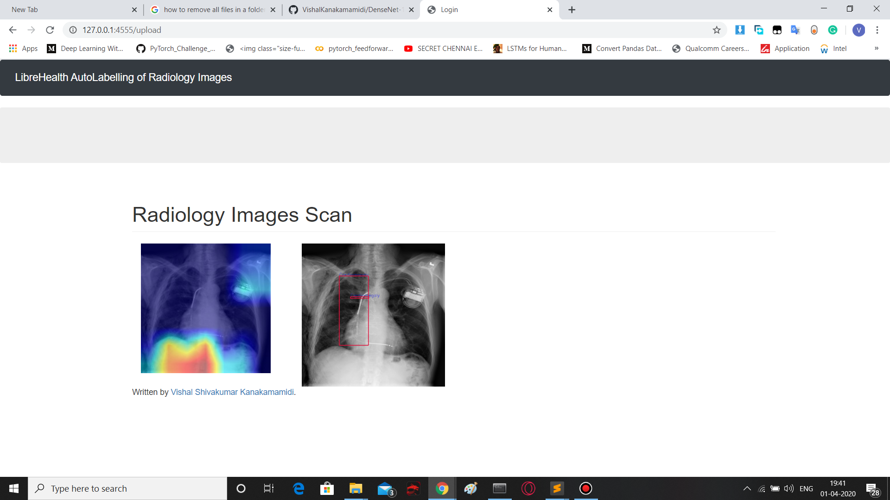

# DenseNet-121-for-Radiology-Images-Annotation
# Introduction
  ●	I have made a POC implementation of "Automating Labeling of Radiology Images" by LibreHealth for GSOC 2020.  
  ●	I am using DenseNet-121 model which was trained on the “NIH ChestX-ray 14” Dataset - https://nihcc.app.box.com/v/ChestXray-NIHCC. I have Applied transfer learning to train as I have used model weights pretrained on ImageNet Dataset. 
  ●	There are total of 8 different disease classes that can be localized in the input images using this Deep Learning model which are 
Atelectasis', 'Cardiomegaly', 'Effusion', 'Infiltration', 'Mass', 'Nodule', 'Pneumonia', 'Pneumothorax'
.  
  ●	I am presently getting Mean Average Precision (mAp) of 75 % using this model.  
  # Environment
  ●	Operating System and Hardware - Windows 10, Nvidia 1660 Ti 6 GB, CUDA 10.0, 8 GB RAM  
  ● Libraries - Python 3.6, pytorch 1.2.0, torchvision 0.2.0, matplotlib 3.1.2, scikit-image 0.16.2, opencv-python 4.1.2, numpy 1.17.4, scipy 1.0.0-3.4.2  
  ● Flask 1.1.1  
  # Implementation
  Input Screen
    
  Output Screen
   
   
   
  You can also refer to this video in youtube for implementation - https://youtu.be/S54008QM6tw
  
  
  
  
